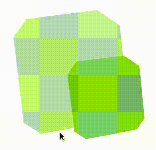

# svgjelly

A react component to turn a svg path into jelly



## install

```bash
npm install --save svgjelly
```

## Usage

```js
// import the Jelly higher order component
import { SvgJelly } from "SvgJelly"

const svg = () => (
  <svg xmlns="http://www.w3.org/2000/svg" viewBox="0 0 582 574">
    <g fill="none" fillRule="evenodd">
      <path fill="#B8E986" d="M0 121.6s-4.5-73.3 57-80.8c14.2-1.8 38.8-5 68-8.5 40.8-5 90.7-11.3 135-17l112-14s89.5-17 100.4 69c2.2 17.2 5 41.2 7.7 68.6 6.4 60.3 13.7 138 19 195l7.3 80.4s6 58.3-48 72.7c-15.6 4-50.5 11.3-92.3 19.3-46.5 9-101 19-147 27-55.3 10-97.7 17.3-97.7 17.3s-71 11.3-77-48.7c-1-11-3.2-30.6-6-55.3-6-54-15.3-132.3-23-198.6L0 121.7z"/>
      <path fill="#7ED321" d="M240 285s-3-50.4 38.3-55.5l46-5.7 90.7-11.4 75.6-9.5s60.2-11.8 67.6 46.2c1.4 11.5 3.2 27.7 5 46.2 4.4 40.8 9.3 93 13 131.6l4.8 54s4 39.5-32.4 49c-10.6 3-34 7.8-62.2 13-31.2 6-68 12.8-99 18.4l-66 11.6s-47.7 7.7-51.7-32.8l-4-37.2L250 369.2 240 285z"/>
    </g>
  </svg>
)
// export your jellified svg
export default SvgJelly(svg)
```

